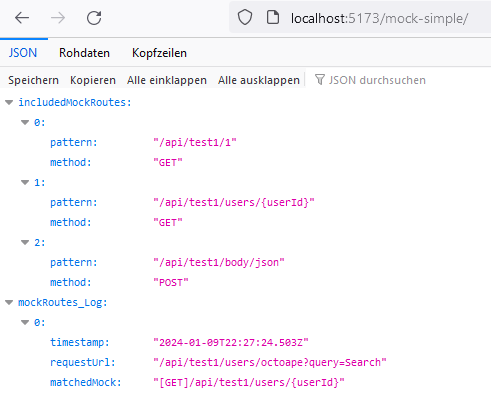
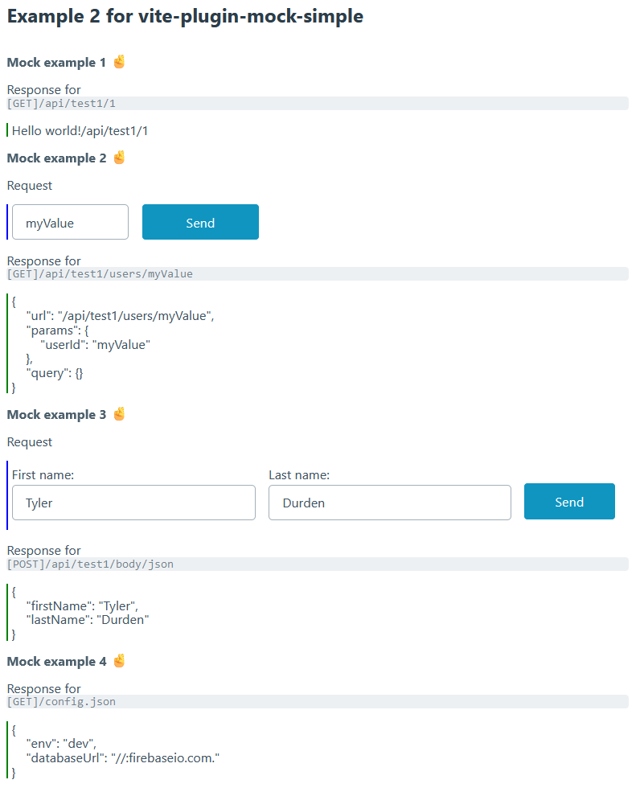

# vite-plugin-mock-simple

[![npm][npm-img]][npm-url]

Provide local mocks for **Vite** to consume them in your app when running development-server.
This is a heavy modified fork of [vite-plugin-mock-server](https://github.com/enjoycoding/vite-plugin-mock-server) by [octoape](https://github.com/octoape) licensed under the MIT-License. Forked to provide a simple vite-mock library.

A mock server plugin for **Vite**, developed based on TypeScript. 
And support using TypeScript and JavaScript to write Mock API. When the Mock API file 
is modified, it will be hot updated automatically. 

## Install

**node version:** >=12.0.0

**vite version:** >=2.0.0

```bash
# if using npm
npm i vite-plugin-mock-simple -D
# if using yarn
yarn add vite-plugin-mock-simple -D
```

## Usage

Config plugin in vite.config.ts and add an array of mocks

```ts
import { defineConfig } from 'vite'
import vue from '@vitejs/plugin-vue'
import mockArray from './mockRoutes'

export default defineConfig({
  plugins: [
    vue(),
    mockSimple(mockArray)
  ]
})
```

Or just fill the mocks in the config file
```ts
import { defineConfig } from 'vite'
import vue from '@vitejs/plugin-vue'
import mockSimple, { MockHandler } from 'vite-plugin-mock-simple'

export default defineConfig({
  plugins: [
    vue(),
    mockSimple([
      {
        pattern: '/api/test1/1',
        handle: (req, res) => {
        res.end('Hello world!' + req.url)
      }
    } as MockHandler
    ])
  ]
})
```

Or import the MockHandler arrays from multiple files
```ts
import { defineConfig } from 'vite'
import vue from '@vitejs/plugin-vue'
import mockSimple from 'vite-plugin-mock-simple'
import routes1 from './mock/es.mock'
import routes2 from './mock/cjs.mock'
import routes3 from './mock/apis/es2.mock'
import routes4 from './mock/apis/cjs2.mock'

export default defineConfig({
  plugins: [
    vue(),
    mockSimple([...routes1, ...routes2, ...routes3(), ...routes4])
  ]
})

```

## Mock file examples

The `pattern` is an ant-style path pattern string, 
use ***[@howiefh/ant-path-matcher](https://www.npmjs.com/package/@howiefh/ant-path-matcher)*** 
to match the `pattern` and `request URL`.

```ts
import { MockHandler } from 'vite-plugin-mock-simple'

export default [
  {
    // use method: 'GET' as default
    pattern: '/config.json',
    // Define a json-response directly, with the response-property 👌
    // in that case you cannot define the handle-property
    response: { databaseUrl: '//:firebaseio.com.', api: 'fake'}
  },
  {
    pattern: '/api/upload/1',
    // use some comma-delimetered values to generate mocks for each of these
    method: 'POST, GET, DELETE, PUT, Patch', 
    handle: (req, res) => {
      // to set an other status code than 200
      res.statusCode = 203 
      res.end('Hello world!' + req.url)
    }
  },
  {
    // * matches zero or more characters
    pattern: '/api/test1/*',
    handle: (req, res) => {
      res.end('Hello world star!' + req.url)
    }
  },
  {
    pattern: '/api/test1/users/{userId}',
    handle: (req, res) => {
      const data = {
        url: req.url,
        params: req.params,
        query: req.query
      }
      res.setHeader('Content-Type', 'application/json')
      res.end(JSON.stringify(data))
    }
  },
  {
    pattern: '/api/test1/body/json',
    method: 'POST',
    handle: (req, res) => {
      res.setHeader('Content-Type', 'application/json')

      // To use the data in the request body, read it from stream:
      // req is incomingMessage which extends stream.Readable 
      // --> https://nodejs.org/api/stream.html#readablereadsize
      // res.end need to be within the function
      // there is a size limit for the bodyString to get parsed 
      req.on('data', (bodyString: string) => { 
        let body: object = JSON.parse(bodyString)
        res.end(JSON.stringify(body))
      })
    }
  },
] as MockHandler[]
```

### Metrics

The plugin will log all mock-routes and requests. These metrics are visible at `//localhost:YOUR-PORT/mock-simple/` when your dev-server is running.

<p align="center">
  
</p>

### Try an example

This repository includes two example apps with some mock-routes
```bash
cd ./example2
npm i
npm run dev
```

<p align="center">
  
</p>

## Exported types by Module

- MockHandler, an array of this objects are requiered by this plugin

```ts
export type MockHandler = {
  pattern: string,
  method?: string,
  handle: (Request: Request, Response: http.ServerResponse) => void || response: Object
}
```

- Request
  
```ts
type Request = Connect.IncomingMessage & { 
  body?: any, 
  params?: { [key: string]: string }, 
  query?: { [key: string]: string },
  cookies?: { [key: string]: string },
  session?: any
}
```

## License

MIT

[npm-img]: https://img.shields.io/npm/v/vite-plugin-mock-simple.svg
[npm-url]: https://npmjs.com/package/vite-plugin-mock-simple
[Vite]: https://vitejs.dev